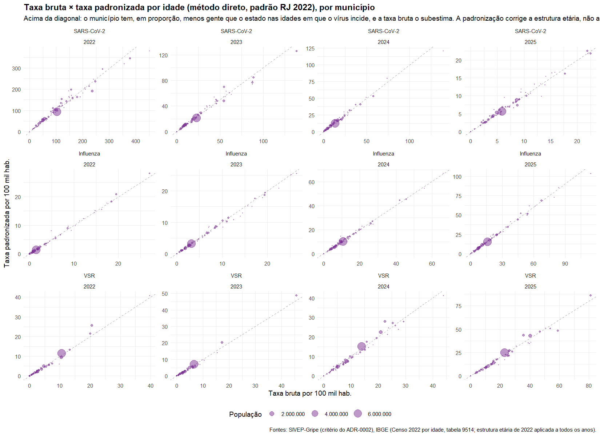
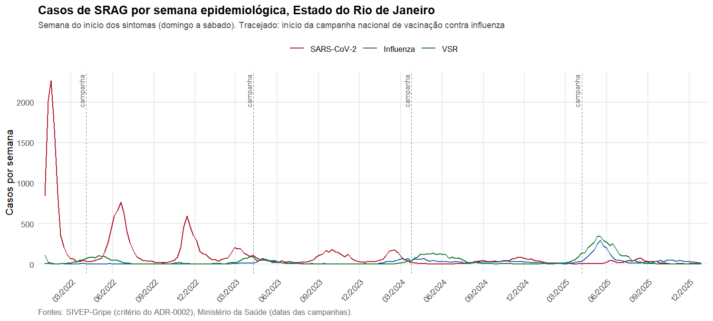
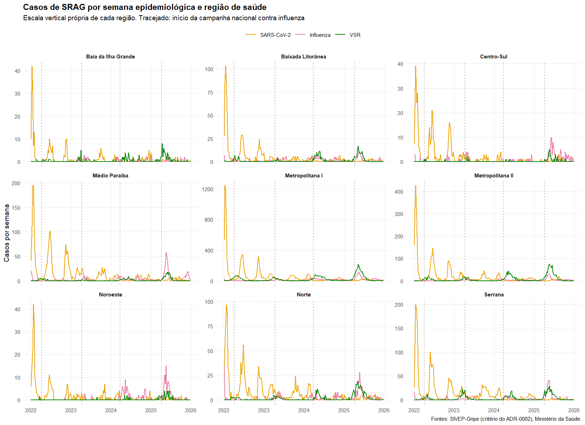
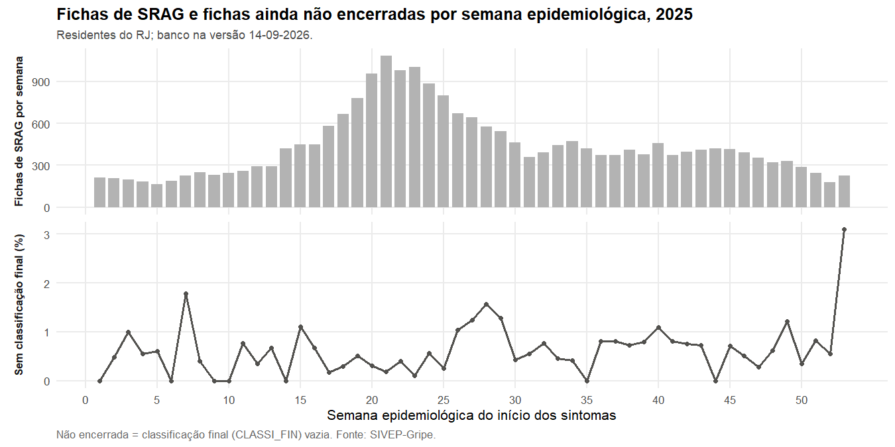
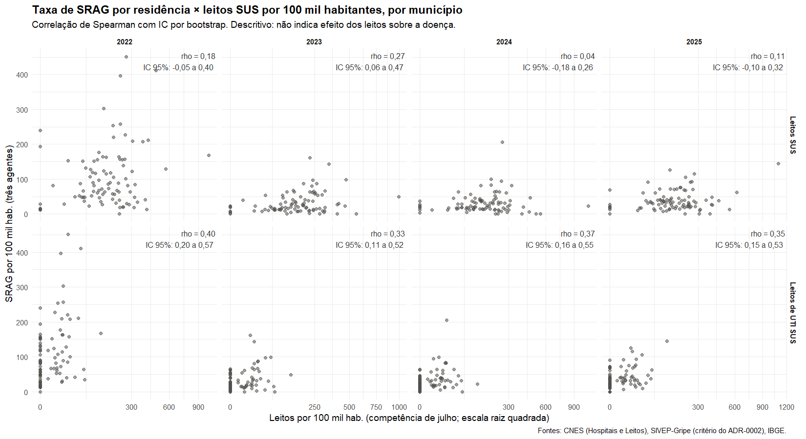

<!--
CS-022. Todo número deste relatório é calculado a partir de resultados/ e dados/
pelos chunks de R; nenhum é digitado (trilha §3.3, invariante 2). O teste
tests/testthat/test-relatorio.R procura números digitados no texto e falha se
encontrar. Rode o pipeline (run.R) antes de renderizar.
-->

```{r setup}
for (arquivo in list.files("R", pattern = "^funcoes_.*\\.R$", full.names = TRUE)) {
  source(arquivo, encoding = "UTF-8", local = TRUE)
}
fi <- function(x) formatC(round(x), format = "d", big.mark = ".", decimal.mark = ",")
fd <- function(x, d = 1) formatC(x, format = "f", digits = d, decimal.mark = ",", big.mark = ".")
fp <- function(x, d = 1) paste0(fd(100 * x, d), " %")
fpv <- function(p) ifelse(p < 0.001, "< 0,001", fd(p, 3))
lista <- function(x) if (length(x) <= 1) x else paste(paste(utils::head(x, -1), collapse = ", "), "e", utils::tail(x, 1))
ler <- function(...) utils::read.csv(file.path(...), encoding = "UTF-8", stringsAsFactors = FALSE)
tab <- function(df, ...) knitr::kable(df, row.names = FALSE, ...)

anos <- ANOS_ESTUDO; ano_ini <- min(anos); ano_fim <- max(anos)
malha <- readRDS(file.path("dados", "processados", "municipios_rj.rds"))
n_mun <- nrow(malha)
man <- ler_manifesto()
bancos <- man[grepl("^dados/brutos/INFLUD", man$arquivo), ]
versao_ult <- bancos$versao[which.max(as.integer(sub(".*INFLUD(\\d\\d).*", "\\1", bancos$arquivo)))]

diag <- ler("resultados", "tabelas", "diagnostico_sivep.csv")
cpa <- ler("resultados", "tabelas", "casos_por_agente.csv")
cmp <- ler("resultados", "tabelas", "comparacao_regras_caso.csv")
dec <- ler("resultados", "tabelas", "decomposicao_sem_campo_especifico.csv")
codet <- ler("resultados", "tabelas", "codeteccao_casos.csv")
est <- ler("resultados", "tabelas", "incidencia_estado.csv")
est <- est[order(match(est$agente, AGENTES), est$ano), ]
suav <- ler("resultados", "tabelas", "suavizacao_bayes_empirico.csv")
suav <- suav[order(match(suav$agente, AGENTES), suav$ano), ]
subt <- ler("resultados", "tabelas", "subtipo_influenza.csv")
popd <- ler("resultados", "tabelas", "diagnostico_populacao.csv")
viz <- ler("resultados", "estatistica", "vizinhos_por_municipio.csv")
ml <- readRDS(file.path("resultados", "estatistica", "moran_lisa.rds"))

nomes <- stats::setNames(malha$nome, malha$cod6)
g <- ml$principal$global
lisa <- ml$principal$lisa; lisa$nome <- nomes[lisa$cod6]
res <- ml$resumo; conc <- ml$concordancia
alfa <- ml$alfa; nsim <- ml$nsim
n_mapas <- nrow(g)
esperado_acaso <- n_mun * alfa
conf <- lisa[lisa$nivel == "confirmado", ]
rot <- function(a) unname(ROTULOS_AGENTE[a])

casos_ag <- tapply(cpa$casos, cpa$agente, sum)
total_casos <- sum(cpa$casos)
tx <- function(ag, a, col = "incid_100k_pop2024") est[est$agente == ag & est$ano == a, col]
degrau_2022 <- tx("sarscov2", ano_ini, "incid_100k") / tx("sarscov2", ano_ini) - 1
sig_global <- g$p_perm < alfa
instaveis <- viz$nome[viz$n_vizinhos == 1]
```

## Resumo

Entre `r ano_ini` e `r ano_fim`, o SIVEP-Gripe [@ms_srag] registrou `r fi(sum(diag$fichas_rj))` fichas de
Síndrome Respiratória Aguda Grave (SRAG) de residentes nos `r n_mun` municípios do Estado do Rio
de Janeiro. Pelo critério de caso adotado (ADR-0002), `r fi(total_casos)` foram casos confirmados
de SARS-CoV-2 (`r fi(casos_ag[["sarscov2"]])`), influenza (`r fi(casos_ag[["influenza"]])`) e
vírus sincicial respiratório, VSR (`r fi(casos_ag[["vsr"]])`).

Com um denominador populacional comum aos anos, a incidência de SRAG por SARS-CoV-2 caiu de
`r fd(tx("sarscov2", ano_ini))` para `r fd(tx("sarscov2", ano_fim))` casos por 100 mil
habitantes, enquanto a de influenza subiu de `r fd(tx("influenza", ano_ini))` para
`r fd(tx("influenza", ano_fim))` e a de VSR de `r fd(tx("vsr", ano_ini))` para
`r fd(tx("vsr", ano_fim))`.

A autocorrelação espacial global foi significativa em `r sum(sig_global)` de `r n_mapas` mapas
(agente × ano), com I de Moran entre `r fd(min(g$I[sig_global]), 2)` e
`r fd(max(g$I[sig_global]), 2)`: fraca a moderada. Após a correção para testes múltiplos, só
`r lista(unique(paste(rot(conf$agente), conf$ano)))` apresentou agrupamentos confirmados:
`r lista(conf$nome[conf$quadrante == "HH"])` (Alto-Alto).

# Introdução

```{r intro}
casos_ini_ag <- tapply(cpa$casos[cpa$ano == ano_ini], cpa$agente[cpa$ano == ano_ini], sum)
casos_fim_ag <- tapply(cpa$casos[cpa$ano == ano_fim], cpa$agente[cpa$ano == ano_fim], sum)
p_ini <- casos_ini_ag / sum(casos_ini_ag); p_fim <- casos_fim_ag / sum(casos_fim_ag)
pop_censo <- sum(popd$pop_2022); pop_min <- min(popd$pop_2022); pop_max <- max(popd$pop_2022)
n_regioes_intro <- length(REGIOES_SAUDE_RJ)
perfil_i <- ler("resultados", "tabelas", "perfil_etario.csv")
p_vsr_bebe <- sum(perfil_i$casos[perfil_i$agente == "vsr" & perfil_i$faixa == "<1"]) / sum(perfil_i$casos[perfil_i$agente == "vsr"])
p_sars_idoso <- sum(perfil_i$casos[perfil_i$agente == "sarscov2" & perfil_i$faixa %in% c("60-69", "70-79", "80+")]) /
  sum(perfil_i$casos[perfil_i$agente == "sarscov2"])
nao_int_intro <- sum(diag$nao_internado) / sum(diag$fichas_rj)
rn_intro <- utils::read.csv(file.path("resultados", "tabelas", "residencia_notificacao.csv"), encoding = "UTF-8",
                            colClasses = c(cod6 = "character"))
p_outro_mun <- sum(rn_intro$not_de_outro_mun_rj) / sum(rn_intro$casos_res)
zeros_intro <- utils::read.csv(file.path("resultados", "estatistica", "zeros_diagnostico.csv"), encoding = "UTF-8")
max_zeros <- zeros_intro[which.max(zeros_intro$zeros), ]
```

## Contextualização

A Síndrome Respiratória Aguda Grave (SRAG) é a forma grave das infecções respiratórias agudas:
o paciente é internado, ou morre, com dispneia, saturação baixa ou desconforto respiratório.
No Brasil, todo caso de SRAG hospitalizado ou óbito por SRAG é de notificação compulsória no
Sistema de Informação de Vigilância Epidemiológica da Gripe (SIVEP-Gripe), cujos microdados
anonimizados o Ministério da Saúde publica em bancos anuais no Portal de Dados Abertos do SUS
[@ms_srag]. Foi esse sistema que permitiu acompanhar, em 2020, a explosão das hospitalizações por SRAG
com a chegada do SARS-CoV-2 e compará-las às da influenza [@bastos2020; @niquini2020]. As taxas deste
relatório medem, portanto, doença grave, e não infecção: `r fp(nao_int_intro)` das fichas de
SRAG do estado declaram que o paciente não foi internado, e o restante foi internado ou morreu.

O período de `r ano_ini` a `r ano_fim` é singular. Encerrada a emergência de saúde pública por
COVID-19, o SARS-CoV-2 deixou de ser o agente dominante e passou a cocircular com a influenza A
e B e com o vírus sincicial respiratório (VSR), cuja carga se concentra em bebês [@li2022]. No
Estado do Rio de Janeiro, entre os casos confirmados dos três agentes, o SARS-CoV-2 passou de
`r fp(p_ini[["sarscov2"]], 0)` em `r ano_ini` para `r fp(p_fim[["sarscov2"]], 0)` em `r ano_fim`,
enquanto a influenza foi de `r fp(p_ini[["influenza"]], 0)` para `r fp(p_fim[["influenza"]], 0)` e
o VSR de `r fp(p_ini[["vsr"]], 0)` para `r fp(p_fim[["vsr"]], 0)`. Os três vírus atingem idades
diferentes: `r fp(p_vsr_bebe, 0)` dos casos de VSR são de menores de um ano, e
`r fp(p_sars_idoso, 0)` dos de SARS-CoV-2 têm sessenta anos ou mais. Esse rearranjo, e não a
pandemia em si, é o objeto deste trabalho.

O Estado do Rio de Janeiro tem `r n_mun` municípios, `r fi(pop_censo)` habitantes no Censo 2022 e
uma organização do SUS em `r n_regioes_intro` regiões de saúde. A população municipal vai de
`r fi(pop_min)` a `r fi(pop_max)` habitantes, e a oferta hospitalar se concentra em poucos polos:
`r fp(p_outro_mun, 0)` dos casos de residentes do estado foram notificados em outro município
que não o de residência, um fluxo já descrito para a região metropolitana [@cavalcante2021].
Isso torna a escolha entre município de residência e município de notificação uma decisão
metodológica, não um detalhe.

## Problematização

A vigilância de SRAG é comunicada, na prática, em escala nacional e estadual: os boletins
InfoGripe da Fiocruz [@infogripe2025] e os painéis do Ministério agregam por unidade da
federação. Em um estado com a heterogeneidade demográfica e assistencial do Rio de Janeiro,
a média estadual esconde municípios com carga de doença grave muito acima ou muito abaixo do
esperado, e não diz se esses municípios formam territórios contíguos, o que teria implicação
direta para a alocação regional de leitos, testagem e vacinação.

Três obstáculos explicam por que essa leitura territorial raramente é feita. O primeiro é o
volume e o formato dos dados: cada banco anual do SIVEP-Gripe tem perto de duzentas colunas e
centenas de milhares de registros nacionais, e extrair, filtrar e classificar por agente exige
código, não planilha. O segundo é a instabilidade estatística dos municípios pequenos: em
`r rot(max_zeros$agente)` de `r max_zeros$ano`, `r max_zeros$zeros` dos `r n_mun` municípios não
tiveram nenhum caso, e um mapa de taxa bruta destaca esse ruído como se fosse padrão. O terceiro
é a falta de pipelines reprodutíveis: análises publicadas raramente disponibilizam código e
dados de forma que outro pesquisador, ou a própria vigilância municipal, reexecute a análise
quando o banco é atualizado.

Este trabalho ataca os três obstáculos com uma prova de conceito: um pipeline aberto em R que
vai do download ao mapa, com estatística espacial que trata os pequenos números e os testes
múltiplos, e com um painel interativo para a vigilância municipal. A pergunta é como as taxas
de incidência de SRAG por SARS-CoV-2, influenza e VSR se distribuem entre os municípios e as
regiões de saúde do estado, de `r ano_ini` a `r ano_fim`, e onde se concentram os agrupamentos
espaciais de alto risco. As hipóteses de trabalho são quatro: H1, as taxas municipais têm
autocorrelação espacial positiva em ao menos um ano; H2, os agrupamentos de alto risco ocupam
territórios diferentes para cada agente; H3, a localização dos agrupamentos muda ao longo do
período; e H4, secundária, parte da heterogeneidade das taxas por residência acompanha a oferta
de leitos hospitalares. A conclusão responde a cada uma.

# Resultados

## Arquitetura do pipeline reprodutível

O pipeline vai do download dos dados abertos ao mapa em scripts R numerados, executados em
ordem por `run.R`. Cada arquivo baixado é registrado com endereço, data e impressão digital
SHA-256 em `dados/MANIFESTO.md`, e nenhuma etapa lê um arquivo que não confira com o registro.
Os bancos do SIVEP-Gripe usados são as versões
`r lista(unique(bancos$versao))` (o banco de `r ano_fim` é atualizado semanalmente; o recorte
deste relatório é a versão `r versao_ult`).

```{r tbl-pipeline}
#| tbl-cap: "Etapas do pipeline"
tab(data.frame(
  Etapa = c("01_etl_sivep.R", "02_indicadores.R", "03_cartografia.R", "04_pesos_espaciais.R",
            "05_moran_lisa.R", "06_visualizacoes.R", "07_exportacao.R", "08_relatorio.qmd"),
  `O que faz` = c("Baixa e confere os bancos do SIVEP-Gripe, filtra o RJ, classifica os casos (ADR-0001, ADR-0002)",
                  "População do IBGE, casos, incidência e suavização por Bayes empírico (ADR-0003)",
                  "Malha municipal oficial do IBGE em SIRGAS 2000 (ADR-0006)",
                  "Vizinhança Queen e pesos espaciais",
                  "Moran global e LISA com correção para testes múltiplos (ADR-0004)",
                  "Mapas de incidência e de agrupamentos",
                  "Tabelas para planilha, com carimbo de versão",
                  "Este relatório e a apresentação"),
  check.names = FALSE))
```

A suíte de testes automatizados (`tests/testthat`) tem
`r length(list.files(file.path("tests", "testthat"), pattern = "^test-.*\\.R$"))` arquivos e roda
sobre uma base sintética, sem acesso à rede.

## Distribuição espacial e taxas de incidência por município

### Fichas e casos

```{r tbl-casos}
#| tbl-cap: "Fichas de SRAG de residentes no RJ e casos confirmados por agente (critério do ADR-0002)"
largo <- stats::reshape(cpa, idvar = "ano", timevar = "agente", direction = "wide")
t1 <- data.frame(Ano = diag$ano, `Fichas de SRAG` = fi(diag$fichas_rj), check.names = FALSE)
for (ag in AGENTES) t1[[rot(ag)]] <- fi(largo[match(diag$ano, largo$ano), paste0("casos.", ag)])
tab(t1)
```

```{r ano-epi}
lim <- limites_ano_epi(anos)
lim53 <- lim[lim$semanas == 53, ]
se53 <- utils::read.csv(file.path("resultados", "tabelas", "serie_semanal.csv"), encoding = "UTF-8")
se53 <- se53[se53$recorte == "Estado do Rio de Janeiro" & se53$ano_epi %in% lim53$ano, ]
casos53 <- sum(se53$casos[se53$semana_epi == 53])
casos_ano53 <- sum(se53$casos)
desvio_jul <- max(abs(as.numeric(as.Date(paste0(lim$ano, "-07-01")) - lim$meio)))
fdia <- function(d) format(d, "%d/%m/%Y")
```

O ano do estudo é o ano epidemiológico do banco: cada banco anual reúne as fichas cujo início
de sintomas cai nas semanas epidemiológicas daquele ano, de domingo a sábado (ADR-0001), e não
o ano civil. `r lista(paste0(lim$ano, " vai de ", fdia(lim$inicio), " a ", fdia(lim$fim)))`.
`r if (nrow(lim53) > 0) paste0("O ano de ", lista(lim53$ano), " tem 53 semanas, 7 dias a mais que os outros; a semana 53 soma ", fi(casos53), " casos (", fp(casos53 / casos_ano53), " do ano), que a taxa anual inclui sem desconto. ") else ""`O
denominador é a população de 1º de julho do ano civil de mesmo número, que fica a no máximo
`r desvio_jul` dias do meio de cada ano epidemiológico; a exceção é o Censo de `r ano_ini`,
com data de referência em 1º de agosto (ADR-0003).

### Incidência no estado e o denominador populacional

```{r tbl-estado}
#| tbl-cap: "Incidência de SRAG no estado, com os dois denominadores (ADR-0003)"
t2 <- data.frame(Agente = rot(est$agente), Ano = est$ano, Casos = fi(est$casos),
                 `Por 100 mil (população do ano)` = fd(est$incid_100k),
                 `Por 100 mil (estimativa 2024)` = fd(est$incid_100k_pop2024), check.names = FALSE)
tab(t2)
```

O Censo `r ano_ini` é uma contagem sem ajuste de cobertura, e as estimativas populacionais do
IBGE posteriores partem dele ajustado [@ibge2024estimativas]. Em todos os municípios a
estimativa de 2024 supera o Censo, de `r fp(min(popd$razao_2024_censo) - 1)` a
`r fp(max(popd$razao_2024_censo) - 1)`. Com o Censo como denominador, a incidência de
SARS-CoV-2 em `r ano_ini` fica `r fp(degrau_2022)` acima da calculada com a estimativa de
2024. Por isso as comparações entre anos usam a estimativa de 2024 como denominador único, e
os mapas de cada ano usam a população oficial daquele ano.

### Mapas de incidência

{#fig-incidencia width=100%}

### Suavização por Bayes empírico

A incidência de um município pequeno é instável: um único caso muda muito a taxa. Por isso os
mapas e a estatística espacial usam a taxa suavizada pelo estimador empírico de Bayes global
[@marshall1991], que aproxima a taxa de cada município da média do estado com força
proporcional à incerteza. A @tbl-suav mostra quanto a suavização alterou a ordem dos
municípios: onde há poucos casos e muitos municípios sem nenhum caso, ela reordena bastante.

```{r tbl-suav}
#| tbl-cap: "Efeito da suavização por agente e ano"
t3 <- data.frame(Agente = rot(suav$agente), Ano = suav$ano,
                 `Municípios sem caso` = suav$municipios_sem_caso,
                 `Maior taxa bruta` = fd(suav$bruta_max_100k), `Maior taxa suavizada` = fd(suav$eb_max_100k),
                 `Correlação de postos` = fd(suav$spearman_bruta_eb, 2),
                 `Mudança mediana` = paste0(fd(suav$mudanca_mediana_pct, 0), " %"), check.names = FALSE)
tab(t3)
```

### Padronização por idade

```{r padronizacao}
# read.csv direto: o auxiliar ler() passa tudo a file.path(), e colClasses viraria parte do caminho.
padr <- utils::read.csv(file.path("resultados", "tabelas", "padronizacao_idade.csv"), encoding = "UTF-8", stringsAsFactors = FALSE,
                        colClasses = c(mun_razao_min = "character", mun_razao_max = "character"))
padr <- padr[order(match(padr$agente, AGENTES), padr$ano), ]
perfil <- ler("resultados", "tabelas", "perfil_etario.csv")
peso <- ler("resultados", "tabelas", "populacao_padrao.csv")
n_faixas <- nrow(peso)
prop_faixa <- function(ag, faixas) {
  x <- perfil[perfil$agente == ag, ]
  sum(x$casos[x$faixa %in% faixas]) / sum(x$casos)
}
p_vsr_bebes <- prop_faixa("vsr", "<1"); p_vsr_menor5 <- prop_faixa("vsr", c("<1", "1-4"))
p_sars_60 <- prop_faixa("sarscov2", c("60-69", "70-79", "80+"))
p_flu_menor5 <- prop_faixa("influenza", c("<1", "1-4")); p_flu_60 <- prop_faixa("influenza", c("60-69", "70-79", "80+"))
extremo_min <- padr[which.min(padr$razao_min), ]; extremo_max <- padr[which.max(padr$razao_max), ]
indm <- as.data.frame(arrow::read_parquet(file.path("dados", "processados", "indicadores_municipais.parquet")))
indm <- indm[indm$casos > 0, ]; indm$razao <- indm$incid_pad_100k / indm$incid_100k
lim_razao <- 0.2; lim_casos <- 10L   # limiares do texto, declarados aqui
fora <- abs(indm$razao - 1) > lim_razao
p_fora_poucos <- mean(indm$casos[fora] < lim_casos); n_fora <- sum(fora)
casos_ext <- function(e, col) indm$casos[indm$cod6 == e[[col]] & indm$agente == e$agente & indm$ano == e$ano]
# Proporção de municípios cuja parcela de menores de 1 ano supera a da população-padrão.
pi9514 <- ler_populacao_idade(ler_fontes()$ibge$populacao_idade$destino)
tot_m <- tapply(pi9514$populacao, pi9514$cod6, sum)
p_mais_bebes <- mean(pi9514$populacao[pi9514$faixa == "<1"] / tot_m[pi9514$cod6[pi9514$faixa == "<1"]] > peso$peso[peso$faixa == "<1"])
vsr_abaixo <- all(padr$razao_mediana[padr$agente == "vsr"] < 1)
n_casos <- function(n) paste(fi(n), if (n == 1) "caso" else "casos")
```

A taxa padronizada por idade pergunta qual seria a taxa do município se ele tivesse a estrutura
etária do estado. Pelo método direto, a taxa de cada uma das `r n_faixas` faixas etárias do
município é ponderada pela participação da faixa na população-padrão, o Estado do Rio de
Janeiro no Censo 2022. Como o IBGE só publica a estrutura etária municipal no Censo, a proporção
de cada faixa em 2022 é aplicada à população de cada ano; a soma das faixas é a população do ano,
e a taxa bruta recalculada das faixas é idêntica à taxa bruta do estudo (contrato do pipeline).

O perfil etário justifica o exercício: `r fp(p_vsr_bebes, 0)` dos casos de VSR são de menores de
um ano e `r fp(p_vsr_menor5, 0)` de menores de cinco; `r fp(p_sars_60, 0)` dos de SARS-CoV-2 têm sessenta
anos ou mais; a influenza fica nos dois extremos (`r fp(p_flu_menor5, 0)` abaixo de cinco anos e
`r fp(p_flu_60, 0)` a partir dos sessenta). Menores de um ano são `r fp(peso$peso[peso$faixa == "<1"], 1)` da
população-padrão.

```{r tbl-padronizacao}
#| tbl-cap: "Taxa bruta × taxa padronizada por idade, por município: correlação de postos e razão padronizada / bruta (municípios com caso)"
t14 <- data.frame(Agente = rot(padr$agente), Ano = padr$ano, `Spearman bruta × padronizada` = fd(padr$spearman_bruta_pad, 3),
                  `Razão mediana` = fd(padr$razao_mediana, 2),
                  `Razão mínima (município)` = paste0(fd(padr$razao_min, 2), " (", nomes[padr$mun_razao_min], ")"),
                  `Razão máxima (município)` = paste0(fd(padr$razao_max, 2), " (", nomes[padr$mun_razao_max], ")"),
                  check.names = FALSE)
tab(t14)
```

A estrutura etária explica pouco do padrão entre municípios: a correlação de postos entre a taxa
bruta e a padronizada fica entre `r fd(min(padr$spearman_bruta_pad), 3)` e
`r fd(max(padr$spearman_bruta_pad), 3)`, e a razão mediana entre
`r fd(min(padr$razao_mediana), 2)` e `r fd(max(padr$razao_mediana), 2)`.
`r if (vsr_abaixo) "No VSR a mediana fica abaixo da unidade em todos os anos" else "No VSR a mediana varia em torno da unidade"`:
`r fp(p_mais_bebes, 0)` dos municípios têm, em proporção, mais menores de um ano que a população-padrão,
cuja estrutura é dominada pela capital. Em municípios isolados a correção é grande, de
`r fd(extremo_min$razao_min, 2)` (`r nomes[extremo_min$mun_razao_min]`, `r rot(extremo_min$agente)` em
`r extremo_min$ano`, `r n_casos(casos_ext(extremo_min, "mun_razao_min"))`) a `r fd(extremo_max$razao_max, 2)`
(`r nomes[extremo_max$mun_razao_max]`, `r rot(extremo_max$agente)` em `r extremo_max$ano`,
`r n_casos(casos_ext(extremo_max, "mun_razao_max"))`); das `r n_fora` combinações município × agente × ano
em que a razão sai da faixa de `r fd(1 - lim_razao, 1)` a `r fd(1 + lim_razao, 1)`, `r fp(p_fora_poucos, 0)` têm menos de `r lim_casos` casos. A
padronização corrige a idade, não a testagem nem o acesso; por isso ela é descritiva e a
análise espacial segue sobre a taxa suavizada.

{#fig-padronizacao width=100%}

### Subtipos de influenza

```{r subtipo}
sa <- stats::aggregate(Freq ~ ano, subt[subt$subtipo == "A" & !is.na(subt$subtipo), ], sum)
st <- stats::aggregate(Freq ~ ano, subt, sum)
prop_a <- sa$Freq / st$Freq[match(sa$ano, st$ano)]
```

A influenza A predominou em todos os anos, de `r fp(min(prop_a), 0)` a `r fp(max(prop_a), 0)`
dos casos de influenza, incluindo os que entraram no critério sem o subtipo informado.

### Sensibilidade ao critério de caso

::: {.content-visible when-format="html"}
O critério adotado (regra "vigilância", ADR-0002) exige a classificação final do agente e a
confirmação laboratorial declarada pela vigilância ou o campo do vírus marcado. A @tbl-regras
compara com a leitura literal da proposta (campo do vírus obrigatório), com a classificação
final sozinha e com a detecção laboratorial pura.
:::

```{r tbl-regras}
#| tbl-cap: "Casos por agente, ano e regra de caso"
r <- cmp[cmp$agente %in% AGENTES & cmp$regra %in% c("R1_estrita_pdf", "R2_vigilancia", "R4_classificacao", "R5_laboratorial"), ]
r$regra <- c(R1_estrita_pdf = "Literal da proposta", R2_vigilancia = "Vigilância (adotada)",
             R4_classificacao = "Só classificação", R5_laboratorial = "Detecção laboratorial")[r$regra]
w <- stats::reshape(r[, c("regra", "agente", "ano", "casos")], idvar = c("agente", "regra"),
                    timevar = "ano", direction = "wide")
w <- w[order(match(w$agente, AGENTES), w$regra), ]
t4 <- data.frame(Agente = rot(w$agente), Regra = w$regra, check.names = FALSE)
for (a in anos) t4[[as.character(a)]] <- fi(w[[paste0("casos.", a)]])
tab(t4)
```

```{r perda}
dc <- dec[dec$agente == "sarscov2", ]
perda <- dc$sem_campo_especifico / dc$classificados
```

A leitura literal da proposta perderia `r fp(perda[1])` dos casos de COVID de `r dc$ano[1]` e só
`r fp(perda[nrow(dc)])` dos de `r dc$ano[nrow(dc)]`, porque o campo "qual vírus" fica em branco
em fichas com resultado positivo, e com frequência que diminui ao longo do período. Essa regra
fabricaria uma queda artificial de COVID. A regra adotada aceita a confirmação laboratorial
declarada pela vigilância mesmo sem resultado nos campos exportados: são
`r fi(dc$so_criterio_laboratorial_declarado[1])` casos de COVID em `r dc$ano[1]`
(`r fp(dc$so_criterio_laboratorial_declarado[1] / tx("sarscov2", ano_ini, "casos"))` do ano),
e essa confiança na declaração é uma limitação assumida.

Cada caso é atribuído a um único agente, o da classificação final; os casos em que outro dos
três vírus também foi detectado são reportados na @tbl-codet, e não contados duas vezes.

```{r tbl-codet}
#| tbl-cap: "Casos confirmados com outro dos três vírus também detectado (co-detecção)"
cw <- stats::reshape(codet, idvar = "agente", timevar = "ano", direction = "wide")
cw <- cw[order(match(cw$agente, AGENTES)), ]
t7 <- data.frame(Agente = rot(cw$agente), check.names = FALSE)
for (a in anos) t7[[as.character(a)]] <- fi(cw[[paste0("Freq.", a)]])
tab(t7)
```

## Agrupamentos espaciais (Moran global e LISA)

A vizinhança é de contiguidade Queen de 1ª ordem sobre a malha oficial do IBGE
[@ibge_malha2022; @pebesma2018; @bivand2013]. O I de Moran global e o Moran local [@anselin1995] foram
testados por `r fi(nsim)` permutações, e os p-valores locais foram corrigidos pelo método de
Benjamini-Hochberg em cada mapa [@benjamini1995], com α = `r fd(alfa, 2)`.

```{r tbl-moran}
#| tbl-cap: "I de Moran global (p por permutação): taxa suavizada, taxa bruta e vizinhança Rook"
glob <- rbind(ml$principal$global, ml$bruta$global, ml$rook$global)
glob$chave <- paste(glob$variavel, glob$vizinhanca)
fmt <- function(i, p) paste0(fd(i, 3), " (", fpv(p), ")")
t5 <- unique(glob[, c("agente", "ano")])
t5 <- t5[order(match(t5$agente, AGENTES), t5$ano), ]
for (k in c("incid_eb_100k queen", "incid_100k queen", "incid_eb_100k rook")) {
  x <- glob[glob$chave == k, ]; x <- x[match(paste(t5$agente, t5$ano), paste(x$agente, x$ano)), ]
  t5[[k]] <- fmt(x$I, x$p_perm)
}
names(t5) <- c("Agente", "Ano", "Suavizada, Queen", "Bruta, Queen", "Suavizada, Rook")
t5$Agente <- rot(t5$Agente)
tab(t5)
```

```{r tbl-lisa}
#| tbl-cap: "Municípios com LISA significativo por mapa, antes e depois da correção"
t6 <- data.frame(Agente = rot(res$agente), Ano = res$ano,
                 `Sem correção` = res$sig_sem_correcao, `Confirmados (FDR)` = res$sig_fdr,
                 `Alto-Alto confirmados` = res$HH_confirmado, `Alto-Alto indicativos` = res$HH_indicativo,
                 `Baixo-Baixo indicativos` = res$LL_indicativo, check.names = FALSE)
t6 <- t6[order(match(res$agente, AGENTES), res$ano), ]
tab(t6)
```

Sem correção, o acaso produziria cerca de `r fd(esperado_acaso)` municípios significativos por
mapa. Os mapas ficam entre `r min(res$sig_sem_correcao)` e `r max(res$sig_sem_correcao)`, e só
`r lista(unique(paste(rot(conf$agente), conf$ano)))` tem municípios que sobrevivem à correção:
`r lista(paste0(conf$nome, " (", unname(NOMES_QUADRANTE[conf$quadrante]), ")"))`.

{#fig-lisa width=100%}

{#fig-vsr width=85%}

A taxa bruta encontra mais autocorrelação que a suavizada: o Moran global da bruta foi
significativo em `r sum(ml$bruta$global$p_perm < alfa)` mapas. A diferença se concentra onde há
muitos municípios sem caso, que formam "agrupamentos de zeros" na taxa bruta; a concordância da
classe LISA entre as duas variáveis por mapa ficou entre `r fp(min(conc$concordancia), 0)` e
`r fp(max(conc$concordancia), 0)`.

### Agrupamento de zeros na taxa bruta

```{r zeros}
zd <- utils::read.csv(file.path("resultados", "estatistica", "zeros_diagnostico.csv"), encoding = "UTF-8", stringsAsFactors = FALSE)
zd <- zd[order(match(zd$agente, AGENTES), zd$ano), ]
lb <- ml$bruta$lisa
cz <- as.data.frame(arrow::read_parquet(file.path("dados", "processados", "indicadores_municipais.parquet")))
lb$casos <- cz$casos[match(paste(lb$agente, lb$ano, lb$cod6), paste(cz$agente, cz$ano, cz$cod6))]
sig_b <- lb[lb$nivel != "ns", ]
g_b <- ml$bruta$global; g_s <- ml$principal$global
chave_z <- zd[which.max(zd$zeros / pmax(zd$zeros_esperados, 1e-9) * (zd$zeros >= 10)), ]
ex <- zd[zd$agente == "vsr" & zd$ano == ano_ini, ]
sb <- sig_b[sig_b$agente == "vsr" & sig_b$ano == ano_ini, ]
gb <- g_b[g_b$agente == "vsr" & g_b$ano == ano_ini, ]; gs <- g_s[g_s$agente == "vsr" & g_s$ano == ano_ini, ]
dif_t <- zd$pct_testadas_outros - zd$pct_testadas_zeros
mx <- zd[which.max(dif_t), ]
```

No VSR de `r ano_ini`, `r ex$zeros` municípios não tiveram nenhum caso. Na taxa bruta, o Moran
global deu p = `r fpv(gb$p_perm)` e o LISA marcou `r nrow(sb)` municípios, `r sum(sb$casos == 0)`
deles sem caso e `r sum(sb$quadrante == "LL")` no quadrante Baixo-Baixo, nenhum confirmado após a
correção; na taxa suavizada, p = `r fpv(gs$p_perm)`. A pergunta é se esses zeros são ausência de
doença.

```{r tbl-zeros}
#| tbl-cap: "Municípios sem caso, por agente e ano: observados, esperados pelo acaso com a taxa do estado, notificação própria e testagem das fichas de SRAG dos seus residentes"
t13 <- data.frame(Agente = rot(zd$agente), Ano = zd$ano, `Sem caso` = zd$zeros,
                  `Esperados pelo acaso` = fd(zd$zeros_esperados, 1),
                  `Sem notificação própria` = zd$zeros_sem_notificacao,
                  `Fichas de SRAG dos residentes` = fi(zd$fichas_zeros),
                  `Testadas (sem caso)` = fp(zd$pct_testadas_zeros, 0), `Testadas (demais)` = fp(zd$pct_testadas_outros, 0),
                  check.names = FALSE)
tab(t13)
```

Se todos os municípios tivessem a taxa do estado, o acaso produziria zeros só nos menores: a
coluna "esperados" soma, município a município, a probabilidade de Poisson de nenhum caso.
Os zeros observados superam os esperados em `r sum(zd$zeros > zd$zeros_esperados)` dos
`r nrow(zd)` mapas; no VSR de `r ano_ini`, `r ex$zeros` contra `r fd(ex$zeros_esperados, 1)`.
Tampouco são municípios sem SRAG: os residentes dos municípios sem caso de VSR em `r ano_ini`
tiveram `r fi(ex$fichas_zeros)` fichas de SRAG, e só `r ex$zeros_sem_notificacao` desses municípios
não notificaram nenhuma ficha no ano. Uma diferença está na testagem: `r fp(ex$pct_testadas_zeros, 0)`
das fichas dos seus residentes têm resultado de RT-PCR ou antígeno, contra
`r fp(ex$pct_testadas_outros, 0)` nos demais municípios; a maior diferença é a de
`r rot(mx$agente)` em `r mx$ano` (`r fp(mx$pct_testadas_zeros, 0)` contra `r fp(mx$pct_testadas_outros, 0)`).
Os municípios sem caso também são menores: mediana de `r fi(ex$pop_mediana_zeros)` habitantes,
contra `r fi(ex$pop_mediana_outros)` nos demais. O padrão é compatível com um agrupamento de
municípios pequenos com menos confirmação laboratorial, mais do que com ausência de doença; os
dados não permitem separar as duas coisas por completo, e é por isso que a análise principal usa
a taxa suavizada (ADR-0004).

## Escala de região de saúde

```{r regioes}
rs <- readRDS(file.path("dados", "processados", "regioes_saude_rj.rds"))
ir <- as.data.frame(arrow::read_parquet(file.path("dados", "processados", "indicadores_regionais.parquet")))
mr <- ml$regional
pesos_reg <- readRDS(file.path("resultados", "objetos", "pesos_regionais.rds"))
n_reg <- nrow(rs)
pares_reg <- contar_ligacoes(pesos_reg$neighbours) / 2
pares_possiveis <- n_reg * (n_reg - 1) / 2
id_reg <- attr(pesos_reg$neighbours, "region.id")
cod_m1 <- rs$cod_regiao[rs$regiao == "Metropolitana I"]; cod_m2 <- rs$cod_regiao[rs$regiao == "Metropolitana II"]
m1_m2_vizinhas <- which(id_reg == cod_m2) %in% pesos_reg$neighbours[[which(id_reg == cod_m1)]]
abaixo <- sum(mr$I < mr$esperado_I)
sig_reg <- sum(mr$p_perm < alfa)
topo <- do.call(rbind, lapply(AGENTES, function(ag) {
  x <- ir[ir$agente == ag & ir$ano == ano_fim, ]
  x[which.max(x$incid_100k), c("agente", "regiao", "incid_100k")]
}))
v24 <- ir[ir$agente == "vsr" & ir$ano == 2024, ]
v24 <- v24[order(-v24$incid_100k), ]
mreg <- as.data.frame(arrow::read_parquet(file.path("dados", "processados", "municipio_regiao.parquet")))
conf_v24 <- conf[conf$agente == "vsr" & conf$ano == 2024 & conf$quadrante == "HH", ]
reg_conf <- unique(mreg$regiao[match(conf_v24$cod6, mreg$cod6)])
frase_conf <- if (length(reg_conf) == 1 && reg_conf == v24$regiao[1]) {
  paste0(", justamente a que contém os agrupamentos Alto-Alto confirmados (", lista(conf_v24$nome), ")")
} else {
  paste0("; os agrupamentos Alto-Alto confirmados estão em ", lista(reg_conf))
}
```

Os `r n_mun` municípios foram agrupados nas `r n_reg` regiões de saúde do estado, com
`r min(rs$n_municipios)` a `r max(rs$n_municipios)` municípios cada. A tabela município → região
vem do Ministério da Saúde, redistribuída pelo pacote geobr [@pereira2019geobr], e foi conferida
contra as páginas de cada região no TabNet da Secretaria de Estado de Saúde. O contorno regional
é a malha municipal do IBGE dissolvida, e a taxa de cada região é a soma dos casos dividida pela
soma da população, não a média das taxas municipais.

```{r tbl-regioes}
#| tbl-cap: "Incidência de SRAG por região de saúde no último ano do estudo (casos por 100 mil hab., população oficial do ano)"
ult <- ir[ir$ano == ano_fim, ]
t7 <- data.frame(Região = rs$regiao, Municípios = rs$n_municipios, check.names = FALSE)
for (ag in AGENTES) {
  x <- ult[ult$agente == ag, ]
  t7[[rot(ag)]] <- fd(x$incid_100k[match(rs$cod_regiao, x$cod_regiao)])
}
tab(t7)
```

Em `r ano_fim`, a região de maior taxa foi
`r lista(paste0(topo$regiao, c(sarscov2 = " no ", influenza = " na ", vsr = " no ")[topo$agente], rot(topo$agente), " (", fd(topo$incid_100k), " por 100 mil)"))`.
No VSR de 2024, o ano dos agrupamentos municipais confirmados, a região com maior taxa foi
`r v24$regiao[1]` (`r fd(v24$incid_100k[1])` por 100 mil)`r frase_conf`.

```{r tbl-moran-regional}
#| tbl-cap: "I de Moran global entre as regiões de saúde (taxa bruta, vizinhança Queen); resultado descritivo"
t8 <- mr[order(match(mr$agente, AGENTES), mr$ano), ]
t8 <- data.frame(Agente = rot(t8$agente), Ano = t8$ano, `I de Moran` = fd(t8$I, 3),
                 `I esperado sem padrão` = fd(t8$esperado_I, 3), `p (permutação)` = fpv(t8$p_perm),
                 check.names = FALSE)
tab(t8)
```

Entre as regiões, a vizinhança Queen tem `r pares_reg` dos `r pares_possiveis` pares possíveis.
`r if (!m1_m2_vizinhas) "As regiões Metropolitana I e Metropolitana II não são vizinhas nessa malha: a Baía de Guanabara e o município de Guapimirim, da região Serrana, as separam, e o mesmo vale entre os municípios delas." else ""`
O I de Moran regional ficou abaixo do valor esperado sem padrão em `r abaixo` dos
`r nrow(mr)` mapas, e foi significativo para autocorrelação positiva em `r sig_reg`. Com
`r n_reg` unidades o teste tem pouco poder, e o LISA não foi calculado: a correção por múltiplos
testes do ADR-0004 anularia quase qualquer sinal. O resultado mostra que os agrupamentos
municipais não se repetem como agrupamentos de regiões; a agregação mistura municípios de taxa
alta e baixa, efeito conhecido como problema da unidade de área modificável [@openshaw1984].

{#fig-regional width=85%}

## Residência e notificação

```{r resnot}
# cod6 como texto: lido como número, "330455" ainda casaria, mas a chave do projeto é texto (ADR-0007)
rnm <- utils::read.csv(file.path("resultados", "tabelas", "residencia_notificacao.csv"), encoding = "UTF-8",
                       stringsAsFactors = FALSE, colClasses = c(cod6 = "character"))
rnm$nome <- nomes[rnm$cod6]
tot_res <- sum(rnm$casos_res); tot_not <- sum(rnm$casos_not)
de_fora_rj <- sum(rnm$not_de_fora_do_rj)
saiu_rj <- sum(rnm$res_not_fora_do_rj); sem_not <- sum(rnm$res_sem_not)
outro_mun <- sum(rnm$not_de_outro_mun_rj)
importadores <- rnm[rnm$saldo > 0, ]; importadores <- importadores[order(-importadores$saldo), ]
exportadores <- rnm[rnm$saldo < 0, ]
exportadores <- exportadores[order(exportadores$saldo), ]
top_imp <- utils::head(importadores, 10)
quase_nada <- rnm[rnm$casos_res >= 100 & !is.na(rnm$razao_not_res), ]
quase_nada <- quase_nada[which.min(quase_nada$razao_not_res), ]
```

As taxas deste relatório contam o caso no município onde o paciente mora. Contado no município
que notificou, isto é, onde o paciente foi atendido, o mesmo conjunto de casos se redistribui:
`r fi(outro_mun)` casos (`r fp(outro_mun / tot_res)`) foram notificados em outro município do
estado, `r fi(saiu_rj)` foram notificados fora do RJ e `r fi(sem_not)` não têm município de
notificação. No sentido inverso, `r fi(de_fora_rj)` casos de moradores de outros estados foram
notificados no RJ, pela mesma regra de caso. Por notificação o estado soma `r fi(tot_not)` casos,
contra `r fi(tot_res)` por residência.

```{r tbl-importadores}
#| tbl-cap: "Municípios que mais notificam casos de moradores de outros municípios (todos os agentes e anos)"
t9 <- data.frame(Município = top_imp$nome, `Por residência` = fi(top_imp$casos_res),
                 `Por notificação` = fi(top_imp$casos_not),
                 `De outro município do RJ` = fi(top_imp$not_de_outro_mun_rj),
                 `De fora do RJ` = fi(top_imp$not_de_fora_do_rj),
                 `Razão notificação / residência` = fd(top_imp$razao_not_res, 2),
                 Saldo = fi(top_imp$saldo), check.names = FALSE)
tab(t9)
```

Só `r nrow(importadores)` dos `r n_mun` municípios notificam mais casos do que têm de residentes
doentes, e `r nrow(exportadores)` notificam menos, porque parte dos seus moradores é atendida em
outro lugar. O que mais perde casos em números absolutos é `r exportadores$nome[1]`
(`r fi(-exportadores$saldo[1])` casos a menos por notificação), e o caso extremo em proporção é
`r quase_nada$nome`: `r fi(quase_nada$casos_res)` casos de residentes e só
`r fi(quase_nada$casos_not)` notificados no município. É por isso que a
taxa por residência é a medida de risco: por notificação, os polos hospitalares pareceriam focos
de doença e os municípios sem hospital de referência pareceriam poupados.

## Série por semana epidemiológica

```{r series}
ss <- utils::read.csv(file.path("resultados", "tabelas", "serie_semanal.csv"), encoding = "UTF-8", stringsAsFactors = FALSE)
ss$inicio_semana <- as.Date(ss$inicio_semana)
est_s <- ss[ss$recorte == "Estado do Rio de Janeiro", ]
n_sem <- length(unique(est_s$inicio_semana))
pico <- do.call(rbind, lapply(AGENTES, function(ag) {
  por_ano <- lapply(anos, function(a) {
    x <- est_s[est_s$agente == ag & est_s$ano_epi == a, ]
    x[which.max(x$casos), c("agente", "ano_epi", "semana_epi", "inicio_semana", "casos")]
  })
  do.call(rbind, por_ano)
}))
camp <- ler_campanhas_influenza()
pico_flu <- pico[pico$agente == "influenza", ]
pico_flu$campanha <- camp$inicio[match(pico_flu$ano_epi, camp$ano)]
pico_flu$semanas_apos <- as.integer((pico_flu$inicio_semana - pico_flu$campanha) / 7)
maior_sars <- pico[pico$agente == "sarscov2", ]; maior_sars <- maior_sars[which.max(maior_sars$casos), ]
ne <- ler("resultados", "tabelas", "nao_encerrados.csv")
nes <- ler("resultados", "tabelas", "nao_encerrados_semanal.csv")
fmt_data <- function(d) format(d, "%d/%m/%Y")
antes <- pico_flu[pico_flu$semanas_apos < 0, ]
# Maturação: últimas 8 semanas do banco × semanas anteriores, com a proporção agregada (fichas somadas).
ult8 <- nes$semana_epi > max(nes$semana_epi) - 8
p_ult8 <- sum(nes$nao_encerradas[ult8]) / sum(nes$fichas[ult8])
p_resto <- sum(nes$nao_encerradas[!ult8]) / sum(nes$fichas[!ult8])
sobe <- p_ult8 > 2 * p_resto
ano_menor <- ne$ano[which.min(ne$proporcao)]
```

A série conta os casos pela semana epidemiológica do início dos sintomas, recalculada da data
(a semana gravada no banco erra a última semana de `r ano_fim`), em `r n_sem` semanas de domingo a
sábado, com zero explícito nas semanas sem caso. O maior pico do período é o de SARS-CoV-2 na
semana `r maior_sars$semana_epi` de `r maior_sars$ano_epi`, com `r fi(maior_sars$casos)` casos.

{#fig-serie width=100%}

```{r tbl-pico-flu}
#| tbl-cap: "Semana de maior número de casos de influenza em cada ano e distância até o início da campanha de vacinação"
t10 <- data.frame(Ano = pico_flu$ano_epi, `Início da campanha` = fmt_data(pico_flu$campanha),
                  `Semana do pico` = pico_flu$semana_epi, `Início da semana do pico` = fmt_data(pico_flu$inicio_semana),
                  Casos = fi(pico_flu$casos),
                  `Semanas da campanha ao pico (negativo = antes)` = pico_flu$semanas_apos, check.names = FALSE)
tab(t10)
```

`r if (nrow(antes) > 0) paste0("Em ", lista(antes$ano_epi), " o pico de influenza vem antes da campanha, na semana ", lista(antes$semana_epi), ": a série começa em alta, com uma epidemia que já vinha do ano anterior. ") else ""`A tabela é
descritiva: a posição do pico em relação à campanha não mede o efeito da vacina, que dependeria
da cobertura vacinal e da cepa em circulação, fora do escopo deste trabalho. As datas das campanhas
são as nacionais; em `r ano_fim` o RJ antecipou a vacinação estadual para o fim de março.

{#fig-serie-regioes width=100%}

### Fichas não encerradas

Ficha não encerrada é a que ainda não tem classificação final; ela não entra como caso de nenhum
agente. A proporção é maior em `r ne$ano[which.max(ne$proporcao)]` (`r fp(max(ne$proporcao))`) e menor
em `r ano_menor` (`r fp(min(ne$proporcao))`)`r if (ano_menor == ano_fim) ", justamente o ano do banco ainda atualizado" else ""`.

```{r tbl-nao-encerrados}
#| tbl-cap: "Fichas de SRAG de residentes do RJ sem classificação final, por ano"
t11 <- data.frame(Ano = ne$ano, Fichas = fi(ne$fichas), `Não encerradas` = fi(ne$nao_encerradas),
                  Proporção = fp(ne$proporcao), check.names = FALSE)
tab(t11)
```

Por semana, no banco de `r ano_fim`, a proporção fica entre `r fp(min(nes$proporcao))` e
`r fp(max(nes$proporcao))`; o valor mais alto é o da semana `r nes$semana_epi[which.max(nes$proporcao)]`,
com `r fi(nes$nao_encerradas[which.max(nes$proporcao)])` de `r fi(nes$fichas[which.max(nes$proporcao)])`
fichas. Nas últimas oito semanas a proporção agregada é `r fp(p_ult8)`, contra `r fp(p_resto)` nas
anteriores: `r if (sobe) "a subida indica que a investigação dessas semanas ainda está em andamento" else "não há a subida sustentada que indicaria investigação em andamento"`.

{#fig-nao-encerrados width=90%}

## Leitos SUS e incidência

```{r leitos}
lt <- as.data.frame(arrow::read_parquet(file.path("dados", "processados", "leitos_rj.parquet")))
spl <- utils::read.csv(file.path("resultados", "estatistica", "spearman_leitos.csv"), encoding = "UTF-8", stringsAsFactors = FALSE)
spl <- spl[order(spl$ano, spl$medida != "leitos_sus_100k"), ]
tot_ano <- stats::aggregate(casos ~ cod6 + ano, data = ind_mun <- as.data.frame(arrow::read_parquet(
  file.path("dados", "processados", "indicadores_municipais.parquet"))), FUN = sum)
dl <- merge(tot_ano, lt, by = c("cod6", "ano"))
dl$taxa <- dl$casos / dl$populacao * 1e5
sem_uti <- tapply(dl$uti_sus == 0, dl$ano, sum)
med_sem <- tapply(dl$taxa[dl$uti_sus == 0], dl$ano[dl$uti_sus == 0], stats::median)
med_com <- tapply(dl$taxa[dl$uti_sus > 0], dl$ano[dl$uti_sus > 0], stats::median)
sem_leito <- tapply(dl$leitos_sus == 0, dl$ano, sum)
sus <- spl[spl$medida == "leitos_sus_100k", ]; uti <- spl[spl$medida == "uti_sus_100k", ]
cruza_zero <- function(x) x$ic_inf < 0 & x$ic_sup > 0
nboot_l <- unique(spl$reamostras)
faixa <- function(x) if (min(x) == max(x)) paste("Em todos os anos,", min(x)) else paste("Entre", min(x), "e", max(x))
```

Os leitos vêm do Cadastro Nacional de Estabelecimentos de Saúde (CNES), no conjunto "Hospitais e
Leitos" do Portal de Dados Abertos do SUS, na competência de julho de cada ano, a mesma data de
referência da população. Os arquivos de `r ano_ini` a `r ano_fim - 1` não trazem o código IBGE do
município; a junção é pelo nome, com duas grafias antigas corrigidas, e no arquivo de `r ano_fim`,
que traz o código, as duas junções concordam em todos os estabelecimentos.
`r faixa(sem_leito)` municípios não têm nenhum leito SUS; `r tolower(faixa(sem_uti))` não têm
leito de UTI SUS.

```{r tbl-leitos}
#| tbl-cap: "Correlação de Spearman entre a taxa de SRAG por residência e os leitos por 100 mil habitantes, por município (IC de 95 % por bootstrap)"
t12 <- data.frame(Ano = spl$ano, `Tipo de leito` = spl$rotulo, Municípios = spl$municipios,
                  `rho de Spearman` = fd(spl$rho, 2),
                  `IC 95 %` = paste(fd(spl$ic_inf, 2), "a", fd(spl$ic_sup, 2)), check.names = FALSE)
tab(t12)
```

A correlação de Spearman compara a ordem dos municípios nas duas medidas; o intervalo de
confiança vem de `r fi(nboot_l)` reamostragens dos municípios. Com o total de leitos SUS, o
intervalo inclui o zero em `r sum(cruza_zero(sus))` dos `r nrow(sus)` anos. Com os leitos de UTI
SUS, o coeficiente fica entre `r fd(min(uti$rho), 2)` e `r fd(max(uti$rho), 2)`, e o
intervalo `r if (any(cruza_zero(uti))) paste("inclui o zero em", sum(cruza_zero(uti)), "ano(s)") else "fica acima de zero em todos os anos"`.
A diferença entre municípios com e sem UTI aparece nas medianas da taxa:
`r lista(paste0(fd(med_com), " por 100 mil com UTI e ", fd(med_sem), " sem UTI (", names(med_com), ")"))`.

Essa associação é descritiva e não indica que leitos causem ou evitem SRAG. Uma hipótese é de
verificação: onde há hospital com UTI, o paciente grave seria internado, testado e notificado
com mais frequência, e o caso apareceria no sistema. Outra é de composição: os municípios com UTI
são maiores e mais urbanos. Distinguir essas hipóteses de uma diferença real de risco exigiria
dados de testagem e de acesso que o estudo não tem.

{#fig-leitos width=100%}

## Protótipo de painel para a vigilância

O painel interativo (`app.R`, Shiny e leaflet) permite escolher o agente, o ano e a camada
(incidência suavizada ou agrupamentos do Moran local). Cada município, ao ser clicado, mostra
casos, população, taxas bruta e suavizada e a classe do LISA; os municípios com um único
vizinho têm borda tracejada. O painel lê as mesmas tabelas deste relatório e é aberto, na raiz
do projeto, com `shiny::runApp()`.

## Disponibilidade de código e dados

```{r tbl-dados}
#| tbl-cap: "Arquivos de entrada registrados no manifesto"
tab(data.frame(Arquivo = basename(man$arquivo), `Versão` = man$versao,
               `Tamanho (kB)` = fi(as.numeric(man$bytes) / 1e3),
               `SHA-256 (início)` = substr(man$sha256, 1, 12), check.names = FALSE))
```

# Discussão

## Interpretação dos padrões espaciais

```{r hipoteses}
h1 <- tapply(g$p_perm < alfa, g$agente, any)[AGENTES]
```

A hipótese de dependência espacial (H1) se sustenta para
`r lista(rot(names(h1)[h1]))`: todos têm ao menos um ano com Moran global significativo. O
sinal, porém, é fraco a moderado, e a hipótese de agrupamentos distintos por agente (H2) só tem
base confirmada em `r lista(unique(paste(rot(conf$agente), conf$ano)))`, no eixo leste da Baía
de Guanabara (`r lista(conf$nome[conf$quadrante == "HH"])`). A hipótese de mudança no tempo
(H3) aparece mais na série de incidência — a retração do SARS-CoV-2 e a expansão de influenza e
VSR — do que na localização dos agrupamentos. Nenhuma dessas associações é causal; a
concentração no eixo leste da região Metropolitana II pode refletir estrutura etária, oferta
assistencial ou fluxo de internações [@cavalcante2021], hipóteses para uma fase seguinte.

## Impacto na vigilância territorial do SUS

O pipeline pode ser reexecutado a cada atualização semanal do banco do ano corrente, registrando
a versão usada, o que transforma a leitura territorial de um exercício pontual em rotina. A
distinção entre agrupamentos confirmados e indicativos permite à vigilância priorizar sem
confundir sinal com acaso.

## Dificuldades e limitações dos dados abertos

```{r limitacoes}
nao_int <- sum(diag$nao_internado) / sum(diag$fichas_rj)
testado <- diag$com_resultado_de_teste / diag$fichas_rj
zeros_vsr <- suav$municipios_sem_caso[suav$agente == "vsr" & suav$ano == ano_ini]
fora_res <- diag$residencia_diferente_notificacao
dc_ini <- dec[dec$agente == "sarscov2" & dec$ano == ano_ini, ]
so_crit <- dc_ini$so_criterio_laboratorial_declarado
dicio <- man$versao[grepl("dicionario", man$arquivo)]
data_dicio <- regmatches(dicio, regexpr("\\d{2}/\\d{2}/\\d{4}", dicio))
sem_pri_errada <- sum(diag$sem_pri_diverge)
ano_sem_pri <- diag$ano[diag$sem_pri_diverge > 0]
tol_painel <- formals(carregar_dados_painel)$tolerancia_m
ind_muni <- ler("resultados", "tabelas", "indicadores_municipais.csv")
pequenas <- sum(ind_muni$casos >= 1 & ind_muni$casos < LIMIAR_CONTAGEM_PEQUENA)
```

- **SRAG notificada, não infecção.** O banco registra casos graves; `r fp(nao_int)` das fichas
  dizem que o paciente não foi internado, e o texto fala em SRAG notificada.
- **Testagem.** A proporção de fichas com resultado laboratorial conclusivo passou de
  `r fp(testado[1])` para `r fp(testado[length(testado)])`; parte do aumento de casos confirmados
  pode vir daí.
- **Denominador.** O degrau entre a contagem do Censo e as estimativas ajustadas foi tratado com
  dois denominadores, mas continua sendo uma escolha.
- **Efeito de borda.** A vizinhança ignora municípios de outros estados;
  `r lista(instaveis)` têm um único vizinho, e a classe LISA deles é marcada como instável.
- **Pequenos números.** Em VSR `r ano_ini`, `r zeros_vsr` municípios não tiveram nenhum caso; a
  suavização atenua, mas não elimina, a incerteza.
- **Estudo ecológico.** As conclusões valem para municípios, não para pessoas, e dependem do
  recorte municipal.
- **Residência × notificação.** As taxas são por município de residência, que é o correto para
  incidência. Mas `r lista(paste0(fi(fora_res), " (", diag$ano, ")"))` fichas foram notificadas
  fora do município de residência. A seção sobre residência e notificação mede esse fluxo
  [@cavalcante2021] em casos, não em internações por hospital nem em distância percorrida.
- **Confirmação declarada.** O critério adotado aceita a confirmação laboratorial declarada pela
  vigilância: em `r ano_ini`, `r fi(so_crit)` casos de COVID
  (`r fp(so_crit / dc_ini$classificados)` dos encerrados como COVID) entraram só por essa
  declaração, sem resultado nos campos exportados.
- **Agrupamentos de zeros.** Zero caso num município pequeno pode ser ausência de testagem, e
  não de doença: no VSR de `r ano_ini`, os municípios sem caso tiveram `r fi(ex$fichas_zeros)` fichas
  de SRAG e menos testagem (`r fp(ex$pct_testadas_zeros, 0)` contra `r fp(ex$pct_testadas_outros, 0)`).
  É por isso que a taxa bruta, que forma agrupamentos desses zeros, é só sensibilidade.
- **Banco vivo.** O banco de `r ano_fim` é atualizado semanalmente; este relatório usa a versão
  `r versao_ult`, e uma versão nova muda os números de `r ano_fim`. Nessa versão, só
  `r fp(ne$proporcao[ne$ano == ano_fim])` das fichas de `r ano_fim` estão sem classificação final
  (entre `r fp(min(ne$proporcao))` e `r fp(max(ne$proporcao))` nos `r length(anos)` anos).
- **Dicionário de dados.** O dicionário oficial é de `r data_dicio`, anterior a parte dos
  bancos; nenhuma coluna nova apareceu entre os anos, mas o domínio de valores de cada campo não
  foi reconferido um a um.
- **Semana epidemiológica do Ministério.** Em `r lista(ano_sem_pri)`, `r fi(sem_pri_errada)`
  fichas da última semana do ano vêm com a semana rotulada como a primeira; o projeto recalcula
  a semana a partir da data de início dos sintomas, e comparações com tabelas oficiais por
  semana precisam levar isso em conta.
- **Suavização global.** O Bayes empírico aproxima cada município da média do estado, não da
  média dos vizinhos; a alternativa local usaria a mesma vizinhança que o LISA testa.
- **Malha do painel.** O painel desenha a malha simplificada em `r tol_painel` m para ficar leve
  no navegador; toda a análise usou a malha oficial completa.
- **Estrutura etária de 2022 em todos os anos.** A padronização por idade usa a proporção de
  cada faixa no Censo 2022 para `r ano_ini` a `r ano_fim`; mudança na estrutura etária de um
  município nesses anos não é captada. O efeito da padronização foi pequeno na ordem dos
  municípios (correlação de postos ≥ `r fd(min(padr$spearman_bruta_pad), 2)`).
- **Escala regional só descritiva.** Com `r n_reg` regiões, o Moran global tem pouco poder e o
  LISA não foi calculado; a taxa regional é bruta, sem suavização, e mistura municípios de taxas
  muito diferentes.
- **Contagens pequenas.** As tabelas publicadas têm `r fi(pequenas)` combinações de município,
  agente e ano com menos de `r LIMIAR_CONTAGEM_PEQUENA` casos. Não há supressão: o
  microdado de origem já é público e anonimizado pelo Ministério, e o projeto só agrega. Quem
  republicar essas tabelas em outro contexto deve avaliar a regra de supressão local.

# Conclusão

```{r conclusao}
anos_sig <- tapply(g$p_perm < alfa, g$agente, sum)[AGENTES]
hh_conf <- conf[conf$quadrante == "HH", ]
mapas_conf <- unique(paste(rot(hh_conf$agente), "em", hh_conf$ano))
anos_txt <- function(n) paste(n, ifelse(n == 1, "ano", "anos"))
ind_hh <- lisa[lisa$quadrante == "HH" & lisa$nivel != "ns", ]
rep_hh <- t(sapply(AGENTES, function(a) {
  x <- ind_hh[ind_hh$agente == a, ]; tb <- table(x$cod6)
  c(municipios = length(tb), em_mais_de_um_ano = sum(tb >= 2))
}))
queda_sars <- tx("sarscov2", ano_ini) / tx("sarscov2", ano_fim)
alta_flu <- tx("influenza", ano_fim) / tx("influenza", ano_ini)
alta_vsr <- tx("vsr", ano_fim) / tx("vsr", ano_ini)
reg_hh_conf <- unique(mreg$regiao[match(hh_conf$cod6, mreg$cod6)])
```

A pergunta era como as taxas de SRAG por SARS-CoV-2, influenza e VSR se distribuem entre os
`r n_mun` municípios e as `r n_reg` regiões de saúde do estado, e onde se concentram os
agrupamentos de alto risco. A resposta, com os dados abertos de `r ano_ini` a `r ano_fim`, é que
a distribuição é desigual, mas o sinal espacial é fraco: a maior parte do que os mapas mostram
é a diferença entre municípios, não a semelhança entre vizinhos.

**H1, dependência espacial: sustentada, com sinal fraco.** O I de Moran global foi
significativo em `r sum(sig_global)` dos `r n_mapas` mapas: `r lista(paste0(rot(AGENTES), " em ", anos_txt(anos_sig[AGENTES])))`.
Os valores ficaram entre `r fd(min(g$I[sig_global]), 2)` e `r fd(max(g$I[sig_global]), 2)`, e na
escala das regiões de saúde o sinal desaparece (`r sig_reg` de `r nrow(mr)` mapas com p abaixo de α).

**H2, especificidade por agente: sustentada só para o VSR.** Após a correção para testes
múltiplos, só `r lista(mapas_conf)` teve agrupamento Alto-Alto confirmado, formado por
`r lista(hh_conf$nome)`, na região `r lista(reg_hh_conf)`, no eixo leste da Baía de Guanabara. A
influenza e o SARS-CoV-2 não tiveram nenhum agrupamento confirmado em nenhum ano; para eles a
hipótese não se sustenta com este critério. A estrutura etária não explica o padrão: a taxa
padronizada por idade preserva a ordem dos municípios (correlação de postos de
`r fd(min(padr$spearman_bruta_pad), 3)` a `r fd(max(padr$spearman_bruta_pad), 3)`).

**H3, dinâmica temporal: sustentada na série, não localizável nos mapas.** No tempo, a
transição é nítida: com o mesmo denominador, a incidência de SARS-CoV-2 em `r ano_fim` foi
`r fd(queda_sars, 1)` vezes menor que em `r ano_ini`; a de influenza, `r fd(alta_flu, 1)` vezes maior; a
de VSR, `r fd(alta_vsr, 1)` vezes maior, com picos de influenza e VSR na temporada de outono e inverno. No espaço, porém, só um mapa tem
agrupamento confirmado, então não há como dizer se os agrupamentos se deslocam. No nível
indicativo, sem correção, dos municípios Alto-Alto de cada agente, aparecem em mais de um ano
`r lista(paste0(rep_hh[, "em_mais_de_um_ano"], " dos ", rep_hh[, "municipios"], " ", c("do SARS-CoV-2", "da influenza", "do VSR")[match(rownames(rep_hh), AGENTES)]))`,
o que é compatível tanto com persistência quanto com acaso.

**H4, oferta de leitos: associação descritiva positiva.** A taxa de SRAG por residência
correlaciona-se com os leitos de UTI SUS por 100 mil habitantes (rho de Spearman de
`r fd(min(uti$rho), 2)` a `r fd(max(uti$rho), 2)`, intervalos acima de zero nos `r nrow(uti)` anos), e
pouco com o total de leitos SUS. Isso não mede efeito: onde há UTI, o caso grave é internado,
testado e notificado, e aparece no sistema.

**O que não pôde ser testado.** A diferença entre ausência de doença e ausência de testagem: os
municípios sem caso tiveram fichas de SRAG com menos confirmação laboratorial que os demais, e
os dados abertos não permitem separar as duas coisas. Nenhuma associação aqui é causal, e a
escala regional, com `r n_reg` unidades, não comporta o Moran local.

**O que o trabalho entrega além da resposta.** Um pipeline que refaz todos os números, mapas e
este texto a partir dos arquivos públicos, com registro de proveniência, testes automáticos e
reprodução byte a byte entre execuções; e um painel para a vigilância municipal. Quando o banco
de `r ano_fim` for atualizado, a análise inteira se refaz com um comando, e é essa
reprodutibilidade, mais do que qualquer mapa isolado, que a vigilância territorial precisa.

# Referências {.unnumbered}

::: {#refs}
:::
